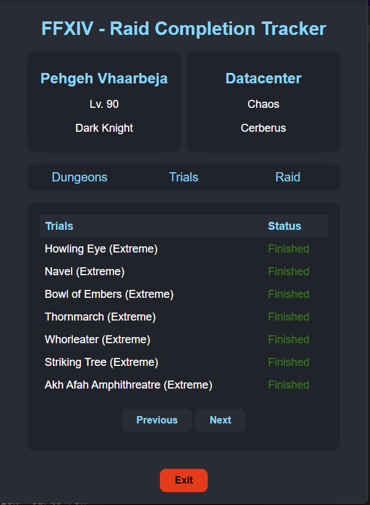

# FFXIV-RaidCompletion
##### A fast and lightweight tracker for dungeon, trial & raid achievements
##### Made & maintained in my free-time, therefore no guarantee for instant bug fixes, updates etc.


___
[](https://github.com/DubskySteam/FFXIV-RaidCompletion/releases/)
## Features
- Overview of your character
- Progression of PvE endgame content (Extreme difficulty or higher)
## How to use
1. Make sure your achievements are public (lodestone -> character settings)
   
   ```This can take up to 90 minutes to take effect. (Up to the FFXIV Servers)```
2. Open data/config.data in any editor and change the character id to yours!
3. Run the application
## Report bugs
To report bugs please use go to "issues" and create a new ticket with the bug report template.
The bug will have a separate issue, where further investigation or clarification will be posted.
## Feature request
To request not implemented features please open a new issue with the corresponding template.
## Screenshots

