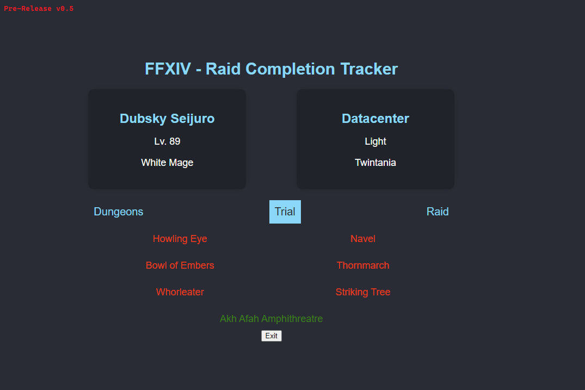

# FFXIV-RaidCompletion
##### A fast and lightweight tracker for dungeon, trial & raid achievements
##### Made & maintained in my free-time, therefore no guarantee for instant bug fixes, updates etc.


___
[](https://github.com/DubskySteam/FFXIV-RaidCompletion/releases/)
## Features [WIP]
- Overview of your character
- Show progression of pve content
## How to use
1. Make your achievements public (lodestone -> character settings)
```This can take up to 30 minutes to take effect.```
3. Open the application per console and enter your character id as 1st argument (can be found in the lodestone url of your char)
4. Done
## Report bugs
If you find any kind of bug, please open an issue (at this repo) with the following details:
1. OS
2. What exactly did/not happen
3. Can you re-produce it 
## Screenshots [WIP]

